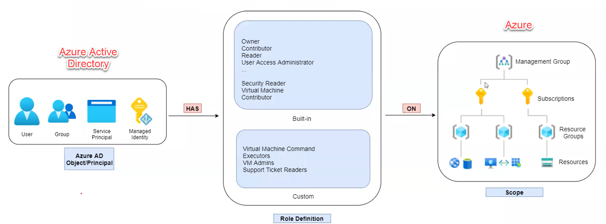

# Azure Architecture

Resource are divided into four level in a **tenant.**

* **Managerment Groups -** manage multiple subscriptions. Can also be placed in a lower hierarchy of another management group. However, keep in mind that there is a single top-level managerment group, i.e., Root management group - for each directory in Azure
* **Subscriptions** - It is a logical unit of Azure services that links to an Azure account like the billing or access control boundary in an Azure AD Directory.\
  **NOTE:** Azure AD Directory may have multiple subscriptions, but each can only trust a single directory. Also, an Azure role applied to a subscription level applies to all the resoures within the subscription.
* **Resource Group** - It is like a box which acts as a container for resources.&#x20;
* **Resources** - It is a deployable item such as - VM, App Service, Storage Account, etc. Moreover, they all must be inside a R**esource Group,** and as it seem, yes the role applies to a resource group will be applied to all the resources and correspondingly if the resource group is deleted then all the resources in it will also be deleted.

<figure><figcaption></figcaption></figure>

### Azure RBAC Roles

Azure RBAC roles (or Azure roles) provides access management for resources using the authorization system of ARM (Azure Resource Manager).

FOUR FUNDAMENTAL ROLES IN AZURE RBAC -

* **Owner :**  Full access to all resources and can manage access for other users
* **Contributor:** Full access to all resources but cannot manage access
* **Reader:** View all resources
* **User Access Administrator:** View all resources and manage access for other users

**IMPORTANT!!!! look the image for clarification and confusion busting towards Azure AD and Azure -**

<figure><figcaption>
Azure AD is not deployed or deployment like Active Directory (AD) but just IAM for Azure, inside Azure services. Also, there is a service in Azure as Azure AD Directory Service which is known as Domain controller as a Service.
</figcaption></figure>

### Security Principal

An Azure AD user, group, service principal or managed identity comes under security principal.

### Role Definition

A simple collection of permissions is role definition.

This will list the actions a security principal can perform (or denied). like read, write or delete.

### Scope

The resource where the role is applied to.

\[Management Group -> Subscription -> Resource Group -> Resources]

### Azure Resource Manager

<figure><figcaption></figcaption></figure>

It is a client neutral deployment and management service for Azure that is used for lifecycle management (creating, updating and deleting) and access control of resources.

* ARM templates can be used for consistent and dependency-defined redeployment of resources.

**NOTE:** If you have a consistent template-based deployment system as ARM templates the chances of misconfiguration in deployments are reduced!!!

### Managed Identity!!! (super important!!!!)

`[one application from the POV of Devs - Helps developer in dealing with secrets]`

Azure provides the ability to assign managed identities to resources like app service, virtual machines, etc.

These managed identities **use Azure AD tokens to access other resources** like **key vault**, **storage accounts, etc** that supports Azure AD Authentication.

**NOTE:** _it is a service principal of special type that can be used with Azure resources_&#x20;

* Managed identities can be **system defined** or **user assigned**!\

  * If I elaborate, then the system defined identities cannot be shared with other resource and are hence tied to a resource.
  * Whereas the user assigned identity can be shared across resource and is independent of the life cycle!

### Azure AD Roles!

IMPORTANT!!! -> **Global Administrator** is the most well-known and all powerful administrator role!\
And it also has the ability to **"elevate"** to **User Access Administrator role** to the **Root Management Group**!!

* Azure AD Roles are applied on Azure AD resources like users, groups, domains, licenses, etc.
* We can also define custom roles!

**NOTE: There is nothing that can save you in Azure from compromised Global Administrator Role!!!!**
